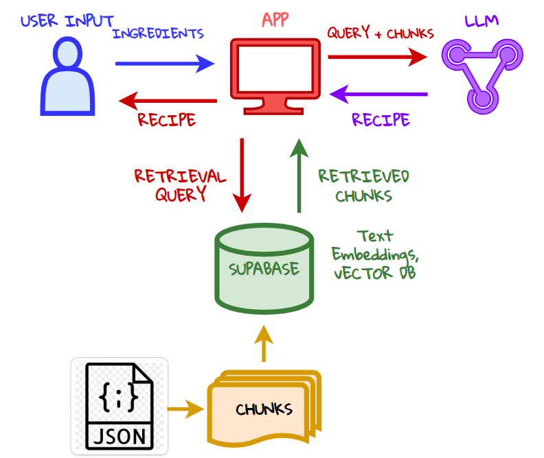

# Resepi GPT 🧑‍🍳

Resepi GPT is an AI-powered Malay recipe search engine that helps you find recipes based on ingredients you have. Built with modern web technologies and AI capabilities.

---

## Features

- 🔍 Ingredient-based recipe search
- 🤖 AI-powered ingredient validation
- 🌃 Dark/Light mode support
- 📱 Responsive design
- 🇲🇾 Malay/English language support
- ⚡ Fast and intuitive interface

---

## Key Steps


1. User Input: Users provide a list of ingredients via the app interface.
2. Query Formation: The app processes the user’s input to create a query, which is sent to both the LLM and Supabase.
3. Data Retrieval from Supabase: Supabase retrieves the most relevant recipe chunks using text embeddings stored in its vector database.
4. Recipe Generation: The retrieved chunks are combined with the user’s query and sent to the LLM, which generates a personalized recipe.
5. Output to User: The app displays the generated recipe to the user.

## Tech Stack

### Frontend
- [Next.js 14](https://nextjs.org/) -
- [TypeScript](https://www.typescriptlang.org/) 
- [Tailwind CSS](https://tailwindcss.com/) 
- [Framer Motion](https://www.framer.com/motion/) 
- [Lucide Icons](https://lucide.dev/)

### Backend & AI
- [OpenAI API](https://openai.com/api/):
  - GPT-3.5 Turbo
  - Text Embeddings - Recipe similarity search
- [Supabase](https://supabase.com/) - Database & Vector search

### Development Tools
- [ESLint](https://eslint.org/)
- [Prettier](https://prettier.io/) 
- [Vercel](https://vercel.com/) 

---

### Steps

1. Clone the repository:

```bash
git clone https://github.com/yourusername/resepi-gpt.git
cd resepi-gpt
```

2. Install dependencies:

```bash
npm install
```

3. Set up environment variables:

```bash
cp .env.example .env.local
```

4. Add your keys to .env.local:

```bash
OPENAI_API_KEY=your_openai_api_key
NEXT_PUBLIC_SUPABASE_URL=your_supabase_url
NEXT_PUBLIC_SUPABASE_KEY=your_supabase_anon_key
```

5. Run the development server:

```bash
npm run dev
```

Open http://localhost:3000 to view the app in your browser.


##Demo

https://github.com/user-attachments/assets/30f6c0b9-3eb7-41ae-b01a-a93643a5a283